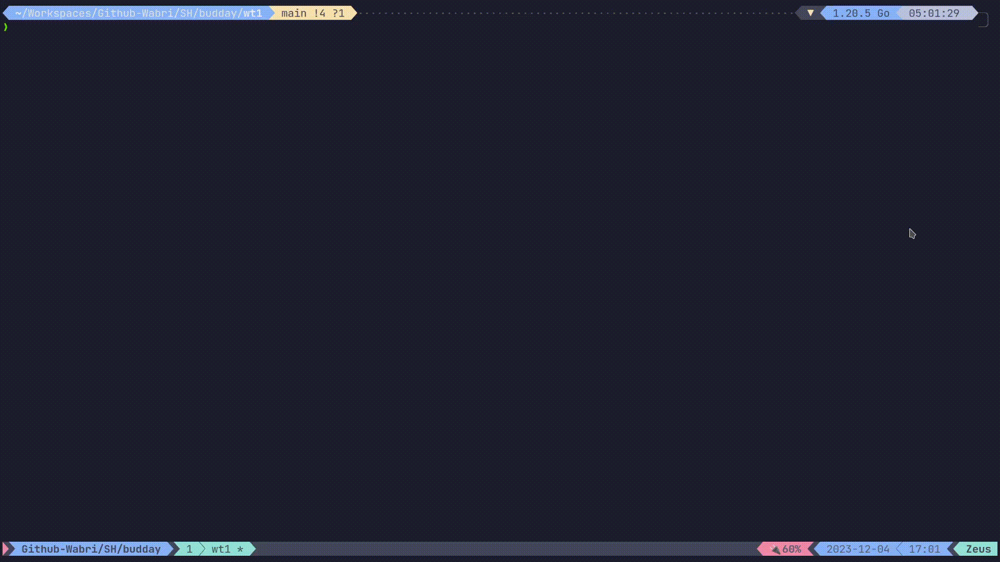

<div align='center'>
  
[![Contributors][contributors-shield]][contributors-url]
[![Forks][forks-shield]][forks-url]
[![Stargazers][stars-shield]][stars-url]
[![Issues][issues-shield]][issues-url]

</div>

<!-- PROJECT LOGO -->
<br />
<div align="center">
  <h1>Budday</h1>
  
  <a href="https://github.com/Schrodinger-Hat/Budday">
    
  </a>

  <p align="center">
    <br />
    <a href="https://github.com/Schrodinger-Hat/Budday/blob/main/README.md"><strong>Explore the docs »</strong></a>
    <br />
    <br />
    <a href="https://www.schrodinger-hat.it/">View Demo</a>
    ·
    <a href="https://github.com/Schrodinger-Hat/Budday/issues">Report Bug</a>
    ·
    <a href="https://github.com/Schrodinger-Hat/Budday/issues">Request Feature</a>
  </p>
</div>

<!-- TABLE OF CONTENTS -->
<details>
  <summary>Table of Contents</summary>
  <ol>
    <li>
      <a href="#about-the-project">About The Project</a>
      <ul>
        <li><a href="#tech-stack">Built With</a></li>
      </ul>
    </li>
    <li><a href="#usage">Usage</a></li>
    <li><a href="#contributing">Contributing</a></li>
    <li><a href="#contact">Contact</a></li>
  </ol>
</details>

<!-- ABOUT THE PROJECT -->

## About The Project

I needed to find a perfect, or nearly perfect, day to schedule a dinner with a group of friends and for this I build this tool to find a spot where most of us can partecipate.

Budday stands for **BUD**dies **DAY** so the day where we celebrate our friendship.

### Tech stack

Golang is the way I go for this kind of things :)

## Usage

Replace the content of [input.txt](/input.txt) with the list of days in the month:

```text
person1name: 1, 20, 25
person1name: 1, 15, 21, 23, 30
person3name: 4, 28, 30
```

After you update the input.txt, just run:

```bash
go mod tidy
go run main.go
```



The first list is the parsed input and the second is the preferred day ordered by number of presents with excluded person.

## Contributing

Contributions are what make the open source community such an amazing place to learn, inspire, and create. Any contributions you make are **greatly appreciated**.

If you have a suggestion that would make this better, please fork the repo and create a pull request. You can also simply open an issue with the tag "enhancement".
Don't forget to give the project a star! Thanks again!

<!-- CONTACT -->

## Contact

Schrodinger's Hat Team - [@schrodinger_hat](mailto:us@schrodinger-hat.it)

Project Link: [https://github.com/Schrodinger-Hat/Budday](https://github.com/Schrodinger-Hat/Budday)

<!-- MARKDOWN LINKS & IMAGES -->
<!-- https://www.markdownguide.org/basic-syntax/#reference-style-links -->

[contributors-shield]: https://img.shields.io/github/contributors/Schrodinger-Hat/Budday.svg?style=for-the-badge
[contributors-url]: https://github.com/Schrodinger-Hat/Budday/graphs/contributors
[forks-shield]: https://img.shields.io/github/forks/Schrodinger-Hat/Budday.svg?style=for-the-badge
[forks-url]: https://github.com/Schrodinger-Hat/Budday/network/members
[stars-shield]: https://img.shields.io/github/stars/Schrodinger-Hat/Budday?style=for-the-badge
[stars-url]: https://github.com/Schrodinger-Hat/Budday/stargazers
[issues-shield]: https://img.shields.io/github/issues/Schrodinger-Hat/Budday.svg?style=for-the-badge
[issues-url]: https://github.com/Schrodinger-Hat/Budday/issues

